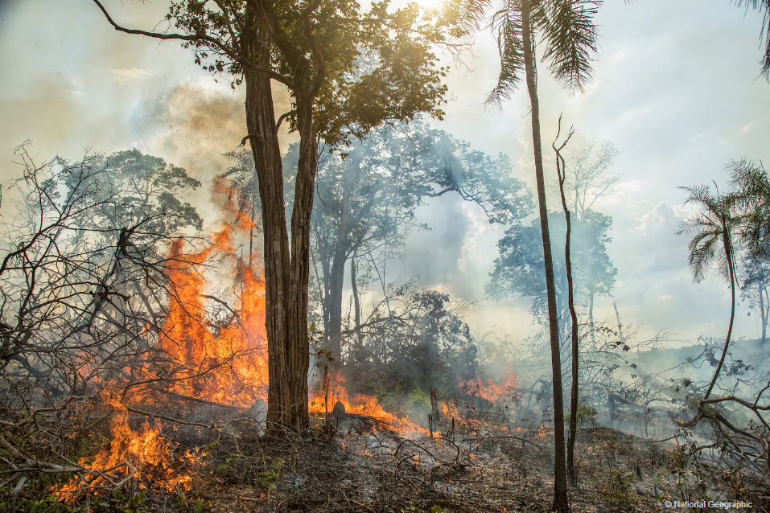
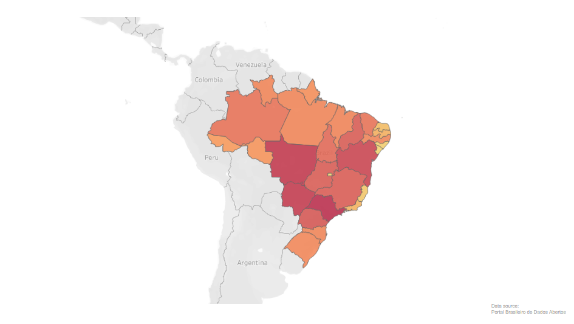
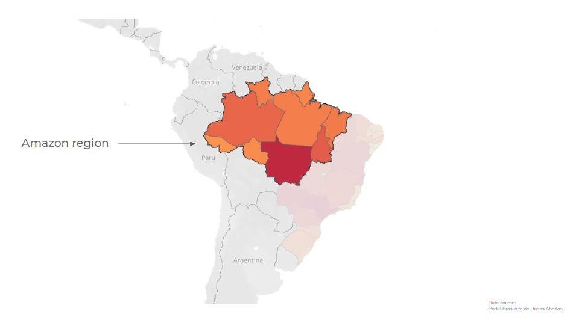
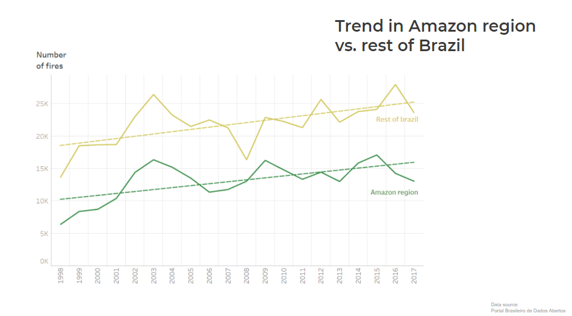

# Wildfires in Brazil

This project entails the analysis of exisiting historical data regarding the occurrence of wildfires in Brazil. A public Tableau version of this project can be viewed on: https://public.tableau.com/profile/javier.silva2842#!/vizhome/wildfires_final/story

## Introduction 

The Amazon forest did not evolve to burn, but the human being has done it for centuries for agricultural purposes. And on top of that, it is well known that global warming has an impact in the state of the forests worldwide.

The aim of this project is to analyze whether there has been a change in the occurrence of wildfires in Brazil over time, and to look at the possibles reasons for these changes.

Data about the number of fires from 1998 to 2017 was found in the portal of open data from the Brazilian government. In light of the unprecedent devastation of the Brazilian forest in 2019, it is unfortunate that data is not available from this source from 2018 up to now. In spite of that, this project is focused on the analysis of the data for the period 1998-2017, as relevant insights may be obtained to explain the events of recent years. 

## Data handling

The data was cleaned and saved into manageable data frames for further analysis and visualization. The detailed data cleaning and handling process can be found in the Jupyter notebook named "Main.ipynb" in the "Notebooks" folder of this repository. 

A Tableau workbook with the main findings can be found in the "Tableau workbooks" folder with the name "wildifres". 

## Analysis

Visualization of the data can be done either in the Tableau workbook or in the "Wildfires in Brazil.pdf" file in this repository.

Wildfires occur all ovewr Brazil, and a closer look at the amazonas region reveals that the combined 9 states have a high frequency of cases, considering that this region is just forest.

An increasing trend of wildfires happening is observed for the whole country in the studied period of time. A steep increase in the number of fires is observed up to 2003, and then the trend decreases steadily until 2008. Splitting the trend line between the Amazon region and the rest of Brazil, it can be observed that the overall number of wildfires from 2003 to 2005 decreases significantly in the whole country.

An online research revealed that president Luiz Inácio Lula da Silva came to power in 2003. He promised to take action to tackle global warming and so he pledged to reduce deforestation by 80% by 2020. This might explain the decrease in number of wildfires in the period 2003-2005. However, there was an increase in the number of fires in the Amazon region from 2005 onwards. Therefore, despite the implementation of policies that aimed at the reduction of deforestation, the actual trend increased over time in the Amazon region. 

During 2011 and 2016, the trend of wildfires kept rising, which might be explained by the recession in 2014, as the country became more reliant on the agricultural commodities, and thus deforestation went up again.

Looking into the deforestation data, and we found that the total forest area loss during those 18 years amounts to almost the size of Germany! This decrease in forest area is correlated to the increase in agricultural activities due to the high demand for soy, palm oil and cattle, which are harvested in the amazonas region. The production of these commodities has hiked steadily in the last 20 years.

Finally, climate factors that could have an impact in the occurrence of wildfires in Brazil were analyzed. It was found that the temperature recorded in Brazil has been increasing slightly whereas the overall level of rain has decreased slightly over the years. These observations are in line with the alarming effects of climate change. Unfortunately, no data is available in detail to study the occurrence of wildfires naturally and due to human activities. However, the effect of climate factors in the spread of fires, specially during drought seasons, cannot be excluded. 

As a conclusion, the data reveals that the occurrence of wildfires in Brazil may have increased over the last 18 years due to human activities to a great extent in addition to climate factors. However, the correlation of the loss of forest area with the increasing demand for agricultural commodities may indicate that the amount of wildfires are mainly caused by deforestation, which is a direct cause of policies poorly implemented or monitored. It shouldn't come as a surprise to know, once the data from the last couple of years is available, that the devastation of the Amazon forest in the last years is due to the direct action of the Bolsonaro government, going backwards in the progress that his predecesors made on this topic.

